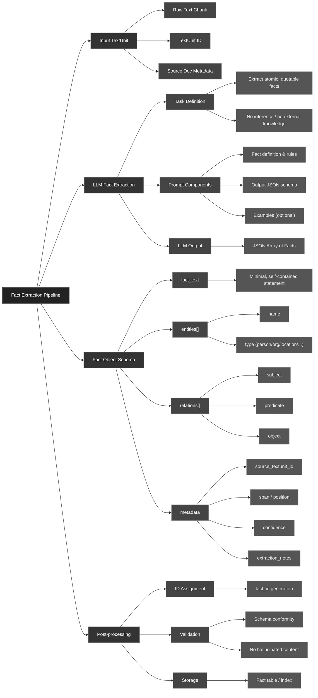

# Q:

GraphRAG V1(community-leading) 使用 Knowledge Graph 的概念建構知識的關聯性進而提供有效率且準確的詢問資料索引架構，但是 V2(fact-leading) 的語意據類是不是根本的放棄了 knowledge graph的想法？ 申論此問題

# A:

**結論先講：**  
GraphRAG V2 的 *fact‑leading* 架構 **並沒有放棄 Knowledge Graph（KG）概念本身**，但它**放棄了「顯式 KG 結構」作為核心索引架構**，改採 **語意聚類 + fact group + GNN 排序** 來取代 V1 的「community graph」。  
換句話說：  
> **V1 是「圖為主體」的 RAG；V2 是「語意為主體」的 RAG。**  
> **V1 用 graph structure 來索引；V2 用語意結構（semantic topology）來索引。**

這不是「放棄 KG」，而是「放棄 KG 的顯式形式」，改成「隱式語意圖（implicit semantic graph）」。

---

## 🧩 一、為什麼你會覺得 V2 放棄了 Knowledge Graph？
因為 V1 的核心是 **community-leading**：  
- chunk → entity extraction  
- entity → graph node  
- relation → graph edge  
- Louvain / Leiden → community detection  
- query → graph traversal → 找到相關社群 → 回答

這是一個非常典型的 **KG-based retrieval pipeline**。  
你可以清楚看到「節點、邊、社群」這些 KG 的基本元素。

但 V2 完全不做這些：  
- 不抽 entity  
- 不建 KG  
- 不做 community detection  
- 不做 graph traversal  
- 不靠 node/edge 來索引

改成：  
- chunk → fact extraction  
- fact → embedding  
- embedding → semantic clustering  
- cluster → fact group  
- GNN → ranking  
- answer → fact group → synthesis

這看起來像是：  
> **從 Knowledge Graph → Semantic Space 的根本轉向。**

所以你會覺得 V2 放棄了 KG。

---

## 🧠 二、但 V2 真的「放棄 KG」嗎？  
**沒有。它放棄的是「顯式 KG」，不是「知識的圖式結構」。**

### V2 仍然保留 KG 的三個核心精神：
- **(1) 知識是由「事實」組成的節點** → fact  
- **(2) 節點之間有語意關聯性** → embedding similarity  
- **(3) 節點會形成語意群落** → fact group

只是：  
- V1 的關聯性是 **symbolic edge**（entity relation）  
- V2 的關聯性是 **semantic edge**（embedding similarity）

V2 的 fact group 本質上就是一種 **implicit graph community**。  
只是它不是用 graph algorithm，而是用 **語意空間的拓撲結構** 來形成群落。

---

## 🔍 三、V1 與 V2 的根本差異：顯式 vs 隱式圖  
### V1：顯式 Knowledge Graph  
- node = entity  
- edge = relation  
- community = graph clustering  
- retrieval = graph traversal  
- ranking = graph centrality

### V2：隱式 Semantic Graph  
- node = fact  
- edge = embedding similarity  
- community = semantic clustering  
- retrieval = semantic neighborhood  
- ranking = GNN（在語意空間上跑）

你可以把 V2 想成：  
> **把 KG 的 node/edge 從 symbolic → semantic embedding。**  
> **把 KG 的 community detection 從 graph algorithm → embedding clustering。**  
> **把 KG 的 traversal → semantic search。**

所以 V2 不是放棄 KG，而是把 KG「隱形化」。

---

## 🧬 四、為什麼 V2 要放棄顯式 KG？  
### 1. V1 的 KG 在大型語料上會崩壞  
- entity extraction 不穩定  
- relation extraction 噪音極高  
- graph 會變成超大稠密網  
- community detection 會失真  
- traversal 成本高  
- graph maintenance 困難

### 2. LLM 的語意能力比 symbolic KG 更強  
LLM 能直接理解：  
- 語意相似  
- 語意推論  
- 語意聚合  
- 語意補全

所以 V2 直接利用 embedding 空間的語意拓撲，比 V1 的 symbolic graph 更準確。

### 3. fact group 更符合 LLM 的推理方式  
LLM 不擅長處理：  
- entity graph  
- symbolic relation  
- graph traversal

但它擅長處理：  
- fact  
- cluster  
- semantic neighborhood

所以 V2 的設計是「為 LLM 最佳化」。

---

## 🧠 五、V2 的語意聚類其實是一種「語意知識圖」  
如果你把 fact embedding 畫成 2D，你會看到：  
- fact 之間形成語意節點  
- fact group 形成語意社群  
- fact group 之間形成語意邊界  
- GNN 在語意空間中跑訊息傳遞

這就是一個 **semantic knowledge graph**。  
只是它不是 symbolic，而是 continuous。

> **V1：symbolic KG**  
> **V2：continuous KG（semantic KG）**

所以 V2 並沒有放棄 KG，而是把 KG 從「符號」變成「語意」。

---

## 🧩 六、總結：V2 是「下一代 KG」，不是「放棄 KG」  
### V1  
- 明確的 KG  
- 明確的 node/edge  
- 明確的 community  
- symbolic graph

### V2  
- 隱式的 KG  
- fact = node  
- embedding similarity = edge  
- fact group = community  
- semantic graph

V2 的語意聚類不是放棄 KG，而是：  
> **把 KG 從「顯式結構」升級成「語意拓撲」。**  
> **從 symbolic graph → semantic graph。**

這是更符合 LLM 時代的知識索引方式。

---

如果你想，我可以進一步深入說明：  
- GraphRAG V2 的語意拓撲到底如何形成  
- fact group 與 KG community 的數學對應  
- 為什麼 GNN 在 V2 中比 graph traversal 更有效  
- 如何在 V2 中重建一個「顯式 KG」作為輔助索引

## Draw a chart to present each section of fact extraction & it's data outline in mermaid, a hierachite chart is better

